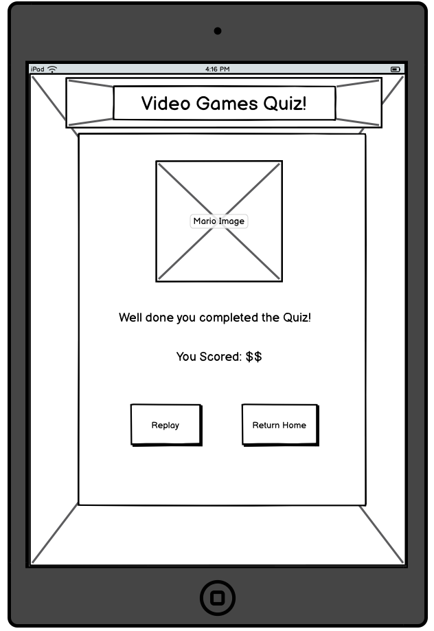

# Video Games Quiz

Welcome to the Video Game Quiz! This exciting web application is your gateway to a world of gaming knowledge. Whether you're a seasoned gamer or just starting your gaming journey, our quiz will put your gaming expertise to the test. Explore questions on your favourite video games, characters, and gaming history. Challenge your friends to see who's the ultimate gaming guru. Get ready to embark on a gaming adventure and show off your gaming prowess.

## Contents

[Planning](https://github.com/RadleighSmith/video-games-quiz#planning)

[Features](https://github.com/RadleighSmith/video-games-quiz#features)

[Testing](https://github.com/RadleighSmith/video-games-quiz#testing)

[Languages](https://github.com/RadleighSmith/video-games-quiz#languages)

[Deployment](https://github.com/RadleighSmith/video-games-quiz#deployment)

[Media](https://github.com/RadleighSmith/video-games-quiz#media)

[Credits](https://github.com/RadleighSmith/video-games-quiz#credits)

## Planning

### Target Audience:

This quiz game is designed for individuals who enjoy testing their general knowledge and trivia skills in an interactive and engaging format. The game is suitable for a diverse range of players, including those who are looking for a fun way to pass the time, challenge their memory, or simply learn new facts. With varying levels of difficulty, it caters to both casual players and trivia enthusiasts.

#### Key Audience Characteristics:

* General knowledge enthusiasts

* Casual gamers looking for a fun challenge

* Individuals seeking to expand their trivia knowledge

* Anyone looking for an engaging way to pass the time

#### Age Group:

* Suitable for teenagers and adults

#### Accessibility:

* User-friendly interface for players of all experience levels

* Mobile-friendly for on-the-go gaming

### User Goals:

* Users aim to evaluate and challenge their general knowledge across various topics.

* Users strive to learn new information and interesting facts while playing the game.

* Users seek entertainment and enjoyment through interactive gameplay and engaging trivia questions.

* Users aspire to achieve high scores and improve their performance with each game.

* Some users may have the goal of competing with friends or family members to see who can score the highest.

* Users want the option to choose a difficulty level that matches their knowledge level, whether they prefer an easy warm-up or a challenging quiz.

* Users may want to keep track of their progress, such as the number of correct answers and their overall performance.

* Users look for a fun and engaging way to pass the time.

* Users expect an intuitive and user-friendly interface that makes it easy to navigate and interact with the game.

### User stories:

* As a casual player, I want to have different difficulty levels available, so I can enjoy the game at a pace that suits my knowledge level.

* As a learner, I want to receive immediate feedback on my answers to help me understand which questions I answered correctly or incorrectly.

* As a competitive player, I want to be able to see my overall score and track my progress over time to challenge myself to improve.

### Colour Scheme:

The quiz game features a palette inspired by a soothing blend of colors. The predominant shade, #7CB9E8, envelops the interface in a calming cerulean blue, evoking a sense of tranquility and curiosity. Complemented by accents of #FEFFC3, a gentle pastel yellow, and #B074CA, a subtle lavender, the scheme achieves a harmonious balance. 

The crisp #FFFFFF serves as the canvas, ensuring optimal readability and a clean, inviting backdrop. Finally, #000000, a classic black, introduces depth and contrast, providing a sturdy foundation for text and interactive elements. Together, these carefully chosen hues not only enhance the game's visual appeal but also contribute to a user-friendly and immersive gaming experience.

Site credit : http://colormind.io/

Employing [contrast grids](https://contrast-grid.eightshapes.com/), we rigorously examined each color combination to ensure optimal readability and visual appeal. By adhering to this thoughtful approach, we have created a visually engaging and user-friendly interface that caters to a diverse audience. This attention to detail reflects our commitment to providing an inclusive and enjoyable experience for all players.

### Wireframes:

Prior to development, we employed wireframing techniques to carefully plan and structure the game's user interface. These wireframes served as a foundational blueprint, outlining the placement of key elements and interactions. By visualizing the layout early in the design process, we were able to refine the user experience, ensuring intuitive navigation and seamless gameplay. This systematic approach enabled us to streamline development efforts and create a polished, user-centric game interface.

#### Desktop

* Homepage

* Quiz Page

* Results Page

#### Tablet

* Homepage

* Quiz Page

* Results Page

#### Smartphone

* Homepage

* Quiz Page

* Results Page

### Typography:

## Features

### Current features

### Future Features

## Testing

### Light House  

### Functional testing

### Validator testing

### Bugs

### Unfixed Bugs

## Languages

## Deployment

## Media

## Credits 
