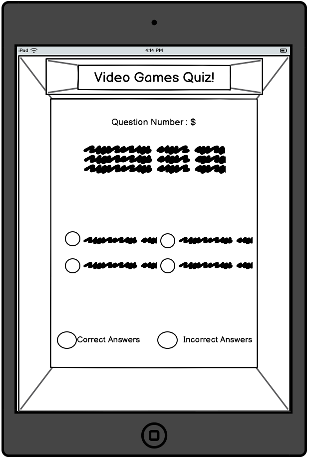
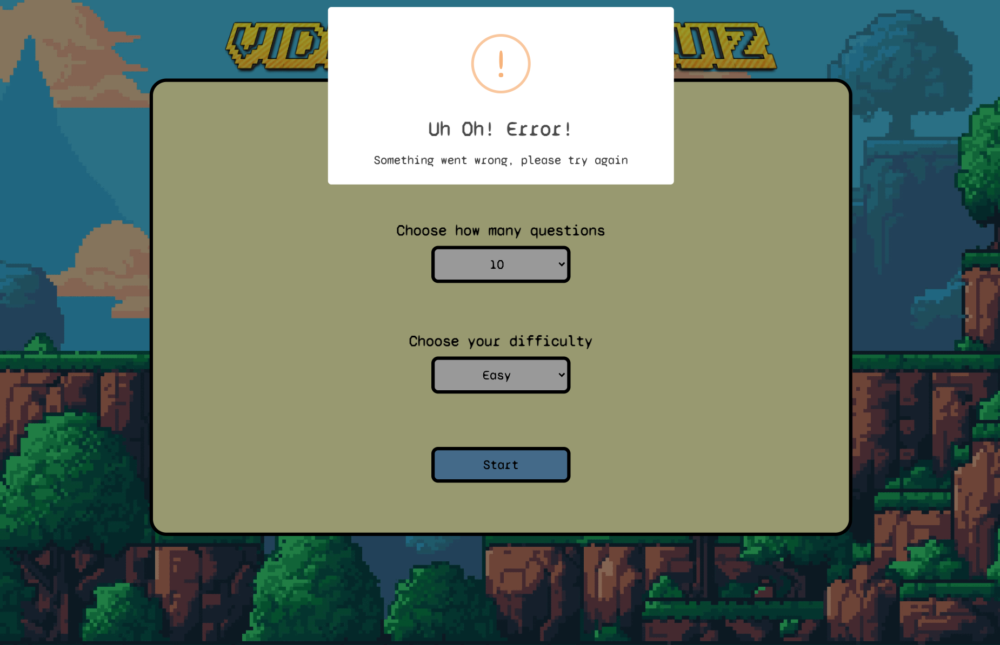

# Video Games Quiz

Welcome to the Video Game Quiz! This exciting web application is your gateway to a world of gaming knowledge. Whether you're a seasoned gamer or just starting your gaming journey, our quiz will put your gaming expertise to the test. Explore questions on your favourite video games, characters, and gaming history. Challenge your friends to see who's the ultimate gaming guru. With dynamic questions that change each time you play, get ready to embark on a gaming adventure and show off your gaming prowess.

## Contents

[Planning](https://github.com/RadleighSmith/video-games-quiz#planning)

[Features](https://github.com/RadleighSmith/video-games-quiz#features)

[Testing](https://github.com/RadleighSmith/video-games-quiz#testing)

[Languages](https://github.com/RadleighSmith/video-games-quiz#languages)

[Deployment](https://github.com/RadleighSmith/video-games-quiz#deployment)

[Media](https://github.com/RadleighSmith/video-games-quiz#media)

[Credits](https://github.com/RadleighSmith/video-games-quiz#credits)

## Planning

### Target Audience:

This quiz game is designed for individuals who enjoy testing their gaming knowledge and trivia skills in an interactive and engaging format. The game is suitable for a diverse range of players, including those who are looking for a fun way to pass the time, challenge their memory, or simply learn new facts. With varying levels of difficulty, it caters to both casual players and trivia enthusiasts.

#### Key Audience Characteristics:

* General knowledge enthusiasts

* Casual gamers looking for a fun challenge

* Individuals seeking to expand their trivia knowledge

* Anyone looking for an engaging way to pass the time

#### Age Group:

* Suitable for all ages.

#### Accessibility:

* User-friendly interface for players of all experience levels

* Mobile-friendly for on-the-go gaming

### User Goals:

* Users aim to evaluate and challenge their general gaming knowledge across various game related topics.

* Users strive to learn new information and interesting facts while playing the game.

* Users seek entertainment and enjoyment through interactive gameplay and engaging trivia questions.

* Users aspire to achieve high scores and improve their performance with each game.

* Some users may have the goal of competing with friends or family members to see who can score the highest.

* Users want the option to choose a difficulty level that matches their knowledge level, whether they prefer an easy warm-up or a challenging quiz.

* Users may want to keep track of their progress, such as the number of correct answers and their overall performance.

* Users look for a fun and engaging way to pass the time.

* Users expect an intuitive and user-friendly interface that makes it easy to navigate and interact with the game.

### User stories:

* As a user, I want to have different difficulty levels available, so I can enjoy the game at a pace that suits my knowledge level.

* As a user, I want to find clear and concise instructions on how to play the quiz, ensuring a smooth start to the game.

* As a user, I want to receive immediate feedback on my answers to help me understand which questions I answered correctly or incorrectly.

* As a user, I want to be able to see my overall score and track my progress over time to challenge myself to improve.

* As a user, I want the option to replay the quiz after completing it, so I can continue to test my knowledge and strive for a better score.

* As a user, I want the quiz to present a diverse range of questions, covering various aspects of video games, ensuring an engaging and comprehensive gaming experience.

* As a user, I want the application to be accessible on multiple devices, allowing me to enjoy the quiz on desktops, tablets, and mobile phones.

* As a user, I want to be able to easily navigate through the quiz, with clear instructions and intuitive controls, to enhance my overall experience.

### Colour Scheme:

The quiz game features a palette inspired by a soothing blend of colors. The predominant shade, #7CB9E8, envelops the interface in a calming cerulean blue, evoking a sense of tranquility and curiosity. Complemented by accents of #FEFFC3, a gentle pastel yellow, and #B074CA, a subtle lavender, the scheme achieves a harmonious balance. 

The crisp #FFFFFF serves as the canvas, ensuring optimal readability and a clean, inviting backdrop. Finally, #000000, a classic black, introduces depth and contrast, providing a sturdy foundation for text and interactive elements. Together, these carefully chosen hues not only enhance the game's visual appeal but also contribute to a user-friendly and immersive gaming experience.

Site credit : http://colormind.io/

Employing [contrast grids](https://contrast-grid.eightshapes.com/), we rigorously examined each color combination to ensure optimal readability and visual appeal. By adhering to this thoughtful approach, we have created a visually engaging and user-friendly interface that caters to a diverse audience. This attention to detail reflects our commitment to providing an inclusive and enjoyable experience for all players.

### Wireframes:

Prior to development, we employed wireframing techniques to carefully plan and structure the game's user interface. These wireframes served as a foundational blueprint, outlining the placement of key elements and interactions. By visualizing the layout early in the design process, we were able to refine the user experience, ensuring intuitive navigation and seamless gameplay. This systematic approach enabled us to streamline development efforts and create a polished, user-centric game interface.

#### Desktop

* Homepage

* Quiz Page

* Results Page

#### Tablet

* Homepage

* Quiz Page

* Results Page

#### Smartphone

* Homepage

* Quiz Page

* Results Page

### Typography:

The typography in our game is characterized by a clean and modern aesthetic, exuding a sense of clarity and readability. We chose ['Manrope'](https://fonts.google.com/specimen/Manrope) and ['Syne Mono'](https://fonts.google.com/specimen/Syne+Mono) from Google Fonts to strike a balance between professionalism and a touch of playfulness. This combination not only ensures visual coherence but also enhances the overall user experience, contributing to a polished and engaging interface.

## Features

### Current features

Our quiz game boasts a range of engaging features designed to provide an interactive and enjoyable experience for players. Key functionalities include:

* Adjustable Difficulty Levels: Tailor the challenge to your knowledge level with options for easy, medium, and hard quizzes.

* Adjustable Question Quantity: Choose the amount of questions you recieve.

* Real-time Feedback: Receive instant feedback on your answers, allowing you to learn and improve as you play.

* Score Tracking: Keep tabs on your progress with a live score counter, providing a sense of achievement and competition.

* Replayability: Easily replay the quiz to further hone your knowledge.

* Responsive Design: Enjoy seamless gameplay on both desktop and mobile devices for flexibility in gaming.

* Intuitive Interface: Navigate the game effortlessly with a user-friendly layout, ensuring an enjoyable experience for all players.

* Expansive Question Database: Using [Open Triva database](https://opentdb.com/) external API the game is able to continuously update and expand the question database to offer fresh and diverse content.

***

* This is the homepage where users can select their preferred quiz length and difficulty level.
* Additionally, users can access instructions on how to play the game by clicking on the 'Instructions' button

***

* The instructions page provides a comprehensive guide on how to navigate and enjoy the quiz game, ensuring that users are well-prepared to embark on their trivia adventure.

***

* Once on the quiz game page, users will be presented with a series of questions tailored to their chosen length and difficulty level
* Users are also able to track their current question number, correct and incorrect scores, providing an engaging and interactive experience.

***

* After completing the quiz, users will be directed to the results page where they can view their final score. 
* Users will also have the option to replay the quiz or return to the homepage for another round of challenging questions.

***

* The game employs the SweetAlert2 library to display visually appealing and user-friendly pop-up messages for correct and incorrect answers, enhancing the overall user experience.

***

* The game includes error handling, providing informative messages to users using sweetAlerts2 in case of any unexpected issues during gameplay.

***

* Should a user navigate to a non-existent page, they will encounter a customized 404 Error Page with a friendly message, image and an option to return to the home page.

***

### Future Features

* Scoreboard: Share your results on a scoreboard to compete with friends, family and other users.

* Social Integration: Share your quiz results on social media platforms or challenge friends to beat your score.

* Time Challenges: Implement timed quizzes for an extra layer of excitement and urgency.

## Testing

Testing plays a pivotal role in ensuring the seamless performance and quality of our video games quiz. Our testing process encompasses a rigorous examination of various aspects specific to gaming. This includes evaluating the accuracy of questions related to video game titles, characters, and milestones. We also conduct thorough checks on interactive elements, ensuring smooth functionality across different gaming platforms and devices. Comprehensive playtesting is carried out to validate game mechanics and address any potential gameplay issues. We aim to deliver a video games quiz that is both informative and enjoyable for all gaming enthusiasts.

I conducted extensive testing throughout the development process on a diverse range of devices and browsers.

Macbook Pro 14" (M2) Safari, - Chrome and Firefox

Windows PC (Windows 11) on a 1440p 27" monitor - Chrome, Firefox and Edge

iPad Air (5th Gen) - Safari and Chrome

iPad Pro (4th Gen) - Safari and Chrome

iPhone 13 Pro Max - Safari and Chrome

iPhone 11 - Safari and Chrome

In cases where I didn't have direct access to a specific device, I leveraged Google Chrome dev tools to emulate the desired environment. This allowed me to conduct real-time testing in responsive dimensions, ensuring a seamless experience across a wide range of user scenarios.

### Light House 

Ensuring a seamless user experience is a top priority for our quiz game. To achieve this, we tested our application using Google's Lighthouse tool. Lighthouse evaluates various aspects including performance, accessibility, SEO, and best practices. By subjecting our quiz to Lighthouse tests, we gain valuable insights into areas that may require enhancement. This includes identifying accessibility issues for users with disabilities, optimizing page load times, and adhering to industry best practices.

Upon pushing the quiz through the lighthouse tool, it was noticed that the file size for the background was causing load times to be too high. Using [Optimizilla](https://imagecompressor.com/) we managed to compress the image by 77% giving us these results:

Lighthouse flagged the 'main-heading.png' as potentially pixelated, but this image is intentionally designed to appear pixelated and it is rendered at its original size, it does not impact the user experience in any way.

* Desktop

* Mobile

### Functional testing

#### Home Page

* Verified that all interactive elements, such as buttons and dropdown menus, are clickable and responsive.
* Tested the question length selection dropdown to ensure it displays available options and allows users to make a selection.
* Confirmed that the difficulty level selection dropdown functions correctly, providing different levels to choose from.
* Checked if the "Start" button triggers the quiz game, logs an array to the console, and directs the user to the quiz based on their selections.
* Validated that the "Instructions" button displays relevant guidance on how to play the game and when return is selected it returns the users to the homepage.
* Ensured that the page layout and design remain consistent across various screen sizes and devices.

#### Quiz Page

* Verified that the question is displayed prominently at the top of the page.
* Tested if the answer choices are presented clearly and are selectable.
* Confirmed that only one answer choice can be selected per question.
* Checked if the question counter displays the correct progress (e.g., "Question 1/10").
* Confirmed that the questions are placed into a random order in an array before being displayed.
* Validated that the correct answer is displayed after selection, along with appropriate feedback (e.g., "Correct" or "Incorrect").
* Tested if the score counters accurately track the number of correct and incorrect answers.
* Verified that the game progresses through all questions and displays the final score page.
* Ensured that the layout and design remain consistent across different screen sizes and devices.

#### Results Page

* Verified that the final score is displayed prominently in the correct position.
* Tested if the "Replay" button allows the user to start a new game with the same settings.
* Confirmed that the "Return to Homepage" button directs the user back to the homepage.
* Validated that the page layout and design remain consistent across different screen sizes and devices.

#### 404 Error Page

* Checked if the 404.html page is displayed when navigating to a non-existent page.
* Verified that the "Error 404! Page Not Found" heading is visible on the 404.html page.
* Ensured that the "Return Home" button is present and clickable on the 404.html page.
* Clicked on the "Return Home" button to confirm that it redirects the user to the homepage.
* Checked the responsiveness of the 404.html page on different devices and screen sizes.
* Used browser developer tools to inspect elements and verify CSS styling on the 404.html page.

### Validator testing            

#### W3C HTML Validation Service

Before deployment, we ensured the validity of our index.html file by passing it through the W3C HTML validation tool with no errors, guaranteeing adherence to web standards and optimal compatibility across browsers.

##### Index.html

##### 404.html

#### WCC Jigsaw CSS Validation Service

Additionally, our stylesheet underwent validation using the CSS Jigsaw tool, ensuring impeccable code quality and compatibility across various browsers and platforms passing with no errors.

#### JSHint JavaScript Code Quaility Tool

However, when passing our script file through JSHint, we noticed that the totalQuestions and Swal where undefined, to fix this we defined totalQuestions in a variable in the top of the page, but Swal is from [SweetAlerts2](https://sweetalert2.github.io/) external library.

After pushing this fix, we received this result for JSHint.

### Bugs:

***

#### Issue: 

Upon game initiation, the answers failed to display properly.

#### Resolution:

Utilizing Google Dev Tools, I identified that the div was being removed. To address this, I organized the answers under a dedicated parent div, assigned it an ID of "answer-area," and established a corresponding variable in the script file. This allowed precise DOM targeting for adding or removing the "hide" class.

#### Outcome:

The answers now appear correctly on the quiz page.

***

#### Issue: 

Post-quiz completion, the question and answers persisted instead of being hidden.

#### Resolution:

I relocated the constant variable from the startGame function to the top of the script file for broader accessibility. This adjustment enabled effective DOM manipulation to control the visibility of questions and answers as needed.

#### Outcome:

The results page now displays as intended.

***

#### Issue:
There was an issue where the question counter failed to increment.

#### Resolution:
To address this, I introduced a variable that directly targeted the element using the DOM.

#### Outcome:
The question counter now accurately counts and displays the progress.

*** 

#### Issue:
There was an issue where the header image was causing the rest of the quiz content to scale incorrectly.

#### Fix:
To address this, I directly targeted the image in the CSS file using the max-width property.

#### Outcome:
The quiz content now scales appropriately without being affected by the header image.

***

#### Issue:
An issue arose where the instructions page button was not hiding as intended.

#### Fix:
To resolve this issue, I moved the ID from the button to the div containing the button. This adjustment ensured that the button displays as intended, and its visibility can be controlled effectively.

#### Outcome:
The instructions page button now hides and displays correctly, aligning with the intended behavior.

***

#### Issue:
The background would move when the SweetAlert 2 pop-up appeared.

#### Fix:
I added heightAuto: false to the Swal.fire function inside the if statement. This prevented the background from shifting.

#### Outcome:
With this fix, the background now remains stable when the SweetAlert 2 pop-up is displayed, enhancing the overall user experience.

***

#### Issue: The hover effect on buttons was persisting on touch devices.

#### Fix: Added a media query for smaller screens that removes the styling of the hover effect.

#### Outcome: The hover effect now behaves as expected on touch devices, providing a smoother user experience.

***
#### Issue:
Answers with special characters were not being decoded correctly when displayed in the SweetAlert2 popup.

#### Fix:
I replaced text: with html: in the SweetAlert2 configuration. This change ensures that the answers with special characters are decoded correctly.

#### Outcome:
With this fix, answers containing special characters are now displayed accurately in the SweetAlert2 popups.

***
Issue: The instructions button on the homepage was not triggering the event listener correctly. Instead, the entire div was causing the event to fire.

Fix: To address this, I implemented a modification by directly targeting the button element using .children[0]. This ensures that the event listener functions as intended, providing a smoother user experience.

Outcome: With this fix in place, users can now click the instructions button without encountering any unexpected behavior, enhancing the overall usability of the application.

***

### Unfixed Bugs

At present, there are no known bugs in the application. It has undergone rigorous testing to ensure a smooth user experience.

## Languages

The quiz game is primarily built using a combination of HTML, CSS, and JavaScript, forming the core structure and functionality of the quiz. JavaScript, in particular, plays a pivotal role in creating dynamic and interactive elements, allowing for real-time feedback and user engagement. Additionally, we utilize external libraries for specific features, enhancing the overall user experience. This blend of web technologies ensures a seamless and responsive gaming experience for players across different devices and platforms.

## Deployment

I deployed the game on GitHub Pages using the following method:

1. From my project [repository](https://github.com/RadleighSmith/video-games-quiz), navigate to the settings tab.

2. From the left-hand menu, select the pages option.

3. From the source section drop-down menu, select the Main Branch.

4. Once the main Branch has been selected, A message will appear and indicate a successful deployment to GitHub pages. A link will also be provided to the game.

Please find the live game via this URL - [Video Games Quiz](https://radleighsmith.github.io/video-games-quiz/)

## Media

Please find a list of all the images used with their respective owner.

| Image |  Image Credit |
| ------------- | ------------- |
| [main-heading.png](assets/images/main-heading.png)| [Text Craft](https://textcraft.net/) |
| [background.png](assets/images/background.png)| [Hiten666](https://tinyurl.com/2kwzr726)  |
| [mario-and-luigi.png](assets/images/mario-and-luigi.png) | [Nibroc-Rock](https://www.deviantart.com/nibroc-rock) |
| [mario-sad.png](assets/images/mario-sad.png) | [Nibroc-Rock](https://www.deviantart.com/nibroc-rock) |

I used [Optimizilla](https://imagecompressor.com/) to compress the image sizes.

## Credits 

* The [Open Triva database](https://opentdb.com/) was used to populate the questions and answers

* [Balsamiq](https://balsamiq.com/) was used for creating the wireframes.

* Fonts used across the site are from [Google Fonts](https://fonts.google.com/)

* [Favicon](https://favicon.io/) for the tab icon.

* [SweetAlert2](https://sweetalert2.github.io/) external library for the incorrect and correct popups

### Thank you

* Code Institute

    I would like to extend my heartfelt gratitude to the entire Code Institute team for their unwavering inspiration in my journey towards becoming a full-stack software developer. The impeccably delivered lessons and their ongoing support have been invaluable, and I deeply appreciate all that they do.

* Richard Wells - Code Institute Mentor.

    Richard has proven to be an invaluable resource throughout my learning journey. JavaScript presented, and continues to present, a challenging learning curve for me. However, Richard has consistently guided me through examples, ensuring I grasp each concept thoroughly. I am immensely grateful to Richard for dedicating his time to assist me. Thank you once again.

## Disclaimer

The content and images on this website are for educational purposes only.

